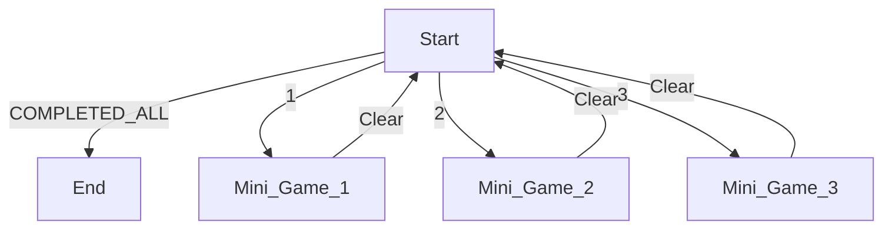

# Conflict (current title of the game) 
### What is it?
- a   **Text-based** RPG with *mini-games*, *nothing fancy*
	 >Title got nothing to do with the game
- *Players* play as themselves 
	>using the screen of their own computer and keyboard


# Getting Started
## Prerequisite
 ```
A running PC/Laptop

Python 3 and IDE

Python  Modules needed:
random, time, libdw.sm

Python Opitonal modules:
tkinter, sys, os
  ```

## How to run the game
 1. Download the [game](https://lol.com) 
 2. Unzip the file
 3. Open up [Game].py file
 4. Enjoy
 ```
 >#DO NOT TRY TO ALT+F4 OR CLT + C
```

## What to Expect
- *Players* have to *read and follow* the instructions in the game
-  *Players* are also required to **type** on their keyboard *when asked for input*
- **No matter what,** **do not** ~~ctrl+c~~ or ~~alt+f4~~ 
>although there is no code to prevent users... ~~YET~~)
- Enjoy *reading and playing* the game **until the very end**
 - Players is not supposed to ~~cannot~~ quit
>**Bonus -- there are certain Easter eggs in the game if you input something smart at the right time
(*Players* can guess the input ~~but that's cheating~~) 


### Game FLOW (Current)
 ``` 
 Start()
 ├── displayIntro
       └──  Part A
	       ├── Tutorial_help
	       ├── Chapters.CHP0
	       ├── Create Player
        └── Part B
	       ├── Chapters.CHP1
	       └── Tutorial_game
			       └── minigames
        └── Part C
	       ├── Chapters.CHP2
	       └── Tutorial_Run
					└── checkPath
        └── Part D
	       └──  Chapters.CHP3
        ├── Credits
        └── Exit()
```

## In game Tutorials
> there are 3 game tutorials to guide *Players*
### Input
```
To understand what to input and when to input
Input only after '>>>'
Should not give anything else other than asked 
```
### Mini Games


### Panic Attack
```
Play to find out
```
### Extra Help
```
The Game Can and Will end, so do not give up
Bugs are not expected if found, it is part of the game
```

## Code Organisation

>Click on this [Link](https://google.com)  to watch a short run of the game

|Objects/Class|Function|What/How|
|----------------|-------------------------------|-----------------------------|
|Interphase ShortCuts |`shorten repeatable codes`| Printing Text and asking for input |
|Simple GUI           |`Add more feel to the game`           |tkinter
|Screen pages          |`Transistion screens`|Generic page of the game|
Choice class (Sentaku)|`To make the game 'more fun' challenging`|Those are not bugs, they are features of the game
|Player class (Ore)|`Create a player`|Elements of the *Player*
|MiniGame|`Gaming elements`|There are currently 3 games |
MiniGames State-machine|`For running the mini games`|Ensure that *Players* clear all the games before continuing
Stories (Chapters)|`PLOT`|Text-based
|Play_Game|`Current path of the game`|Linear Game story line

>#DO NOT EDIT ANYTHING

## Acknowledgments
#AML
